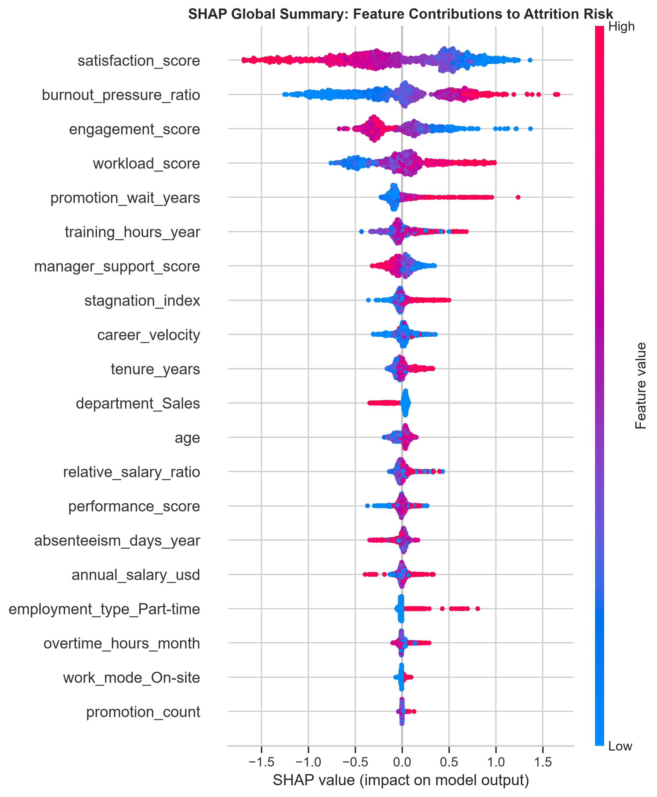
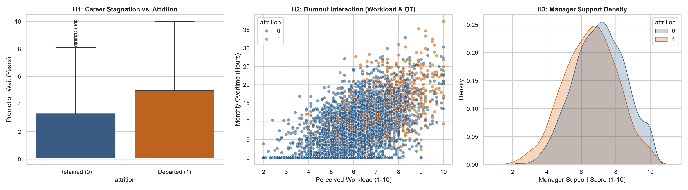

# 📊 Workforce Attrition Intelligence & Constrained Retention Optimizer

An end-to-end Machine Learning, Unsupervised Archetype Segmentation, and Constrained ROI Optimization platform designed to identify employee turnover risk, diagnose root causes, and maximize the financial return on retention capital.

[](https://www.python.org/)
[](https://scikit-learn.org/)
[](LICENSE)

---
## 📌 Executive Summary

Employee turnover carries significant organizational costs, typically estimated at **1.5× an employee's annual salary** in replacement and productivity loss. This project moves beyond standard risk prediction by framing workforce retention as a **constrained capital allocation problem**.

> ⚠️ **Synthetic Data Disclaimer**  
> The workforce dataset utilized in this project is entirely synthetic and engineered for modeling, benchmarking, and instructional demonstration purposes. It does not contain Real Personal Data (RPD) or proprietary information from any corporate entity. All employee IDs, salaries, performance metrics, and survey scores were stochastically generated while maintaining realistic econometric statistical properties.

---
### 🏆Key Outcomes & Capabilities
- **Predictive Risk Scoring**: Dual-model benchmarking using Econometric Logistic Regression and Calibrated Histogram-based Gradient Boosting (`HistGradientBoosting`), achieving **ROC-AUC ~0.81** with strictly calibrated probability outputs.
- **Explainable AI (XAI)**: Global and local SHAP feature attribution pinpointing top turnover drivers (`satisfaction_score`, `burnout_pressure_ratio`, `promotion_wait_years`).
- **Latent Workforce Archetypes**: Unsupervised PCA dimensionality reduction and K-Means clustering to isolate structural workforce risk profiles.
- **Constrained ROI Optimization**: A portfolio optimization framework allocating a fixed retention budget to maximize net financial value saved. In baseline runs, deploying **$50,000 across 20 high-value targets yields $742,000+ in expected turnover savings (~1,385% Net ROI)**.
- **Executive Decision Dashboard**: Interactive Streamlit web application for real-time scenario simulation, portfolio adjustment, and executive reporting.

---
## 🔍 Explainability & AI Governance

To ensure ethical, transparent, and non-discriminatory HR decision-making, the platform incorporates multi-layered Explainable AI (XAI):

* **Global Risk Drivers (SHAP Beeswarm Analysis)**:  
  Identifies enterprise-wide turnover drivers across all departments. Primary drivers isolated include **Low Satisfaction Score**, **High Burnout Pressure Ratio**, **Elevated Overtime Hours**, and **Extended Promotion Wait Times**.
  

* **Econometric Validation & Hypothesis Testing**:  
  Exploratory data analysis validates core hypotheses prior to model inference, ensuring algorithmic features align with real-world economic risk factors (e.g., Career Stagnation Penalty, Effort-Reward Imbalance).
  

* **Local Individual Diagnoses**:  
  Every employee recommendation includes localized SHAP attributions explaining *why* that specific worker is flagged, enabling HR Business Partners to tailor custom retention plans.

* **Responsible AI Audits**:  
  Includes data quality profiling, duplicate handling, and missing value checks in `src/audit_data.py` to prevent algorithmic bias and inaccurate risk scoring.

---
## 🚀 Getting Started

### Prerequisites
Ensure you have Python 3.10+ installed. Clone the repository and set up a virtual environment:
```bash
git clone <your-repo-url>
cd workforce_attrition_project
python -m venv .venv
source .venv/bin/activate  # On Windows: .venv\Scripts\activate
pip install -r requirements.txt
```

---
## 📁 Repository Structure

```text
workforce_attrition_project/
├── data/
│   ├── raw/                # Raw workforce data inputs
│   └── processed/          # Preprocessed train/test split datasets
├── reports/                # Visualizations, SHAP summary plots, and cluster maps
│   ├── shap_global_summary.png
│   └── workforce_clusters_pca.png
├── src/                    # Core Python source modules
│   ├── __init__.py
│   ├── audit_data.py       # Data quality, completeness, and class imbalance checks
│   ├── features.py         # Feature engineering & Scikit-Learn preprocessing pipeline
│   ├── models.py           # Model training, dual evaluation, and probability calibration
│   ├── explainability.py   # SHAP value extraction and feature attribution plots
│   ├── segmentation.py     # PCA dimensionality reduction & K-Means archetype profiling
│   ├── retention_optimizer.py # Constrained budget ROI optimization algorithm
│   └── dashboard.py        # Streamlit executive decision support application
├── tests/                  # Automated pytest test suite
│   ├── test_features.py    # Feature transformer edge cases (zero-division guards)
│   ├── test_pipeline.py    # Data leakage isolation & output shape invariants
│   └── test_models.py      # Checks for model training and calibration
├── .gitignore
├── main.py                 # End-to-end execution pipeline orchestrator
├── requirements.txt        # Python package dependencies
└── README.md               # Project documentation
```

---
## 🤖 Engineering Approach & AI Collaboration Disclosure 
This project was engineered following modern AI-assisted software development practices:
- Iterative Agile Sprints: Developed sequentially across daily milestones focusing on modular architecture, unit test coverage, and strict separation of concerns (src/ vs tests/ vs reports/). 
- Human-in-the-Loop Architecture: High-level problem formulation, business context constraints ($1.5\times$ salary multiplier, success rate estimation), and UI/UX requirements were driven by human domain leadership. AI pair-programming agents (Gemini) were leveraged for boilerplate generation, refactoring, pipeline orchestration, and mathematical formula verification.   
- Production-Grade Design: All code adheres to strict PEP 8 guidelines, dynamic path resolution, automated test suites via pytest, and graceful exception handling.